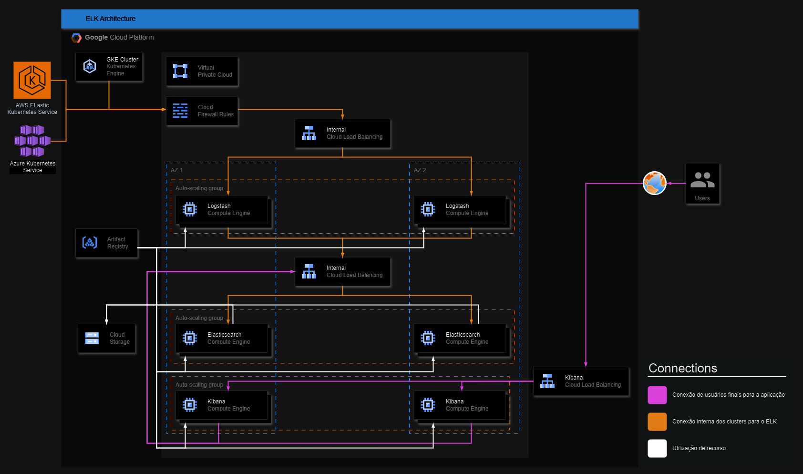

# Wordpress EKS

[Documentação](./Planejamento/Desafio%20Final%20-%20Henrique.pdf)

## Endpoints

- [wordpress](https://wordpress.htsuyoshiy.online)
- [grafana](https://grafana.htsuyoshiy.online)
- [kubernetes-dashboard](https://kubernetes.htsuyoshiy.online)
- [kubecost](https://kubecost.htsuyoshiy.online)
- [defect-dojo](https://defect-dojo.htsuyoshiy.online)
- [kube-ops-view](https://kube-ops-view.htsuyoshiy.online)

## Descrição

Projeto final realizado para o fim do Ignite 2023.

A proposta do projeto era desenvolver wordpress em microsserviços.

### Arquitetura AWS

### Arquitetura Kubernetes

### Arquitetura ELK

